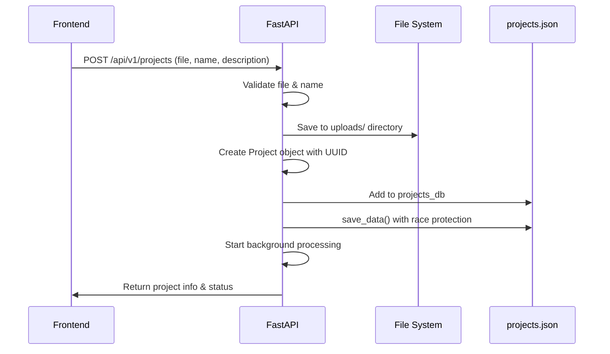
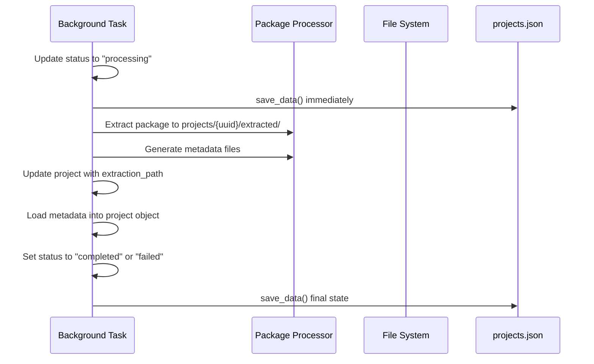
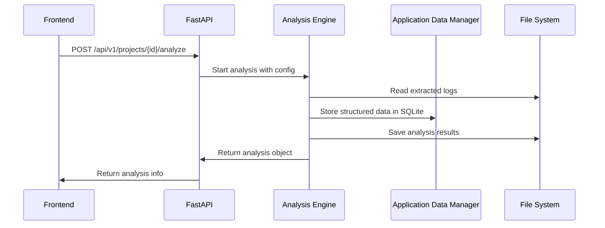

# Project Management System Design

## 🎯 **Overview**

This document defines the robust project management architecture for the prplOS LCM Log Analysis System, designed to prevent data loss, ensure consistency, and provide reliable project lifecycle management.

## 🏗️ **Architecture Principles**

### **1. Single Source of Truth**
- **`projects.json`**: Authoritative project registry
- **UUID-based identification**: Immutable project identifiers
- **Atomic operations**: All-or-nothing data changes
- **Defensive programming**: Protection against race conditions

### **2. Project-Centric Data Organization**
```
/data/WNC/LCM-Logs-Data/projects/{project-uuid}/
├── extracted/                      ← Package extraction results
│   ├── metadata/                   ← Extraction metadata
│   │   ├── package_structure.json
│   │   └── application_discovery.json
│   └── {original-package-contents}
├── analysis/                       ← Project-specific analyses
│   ├── {analysis-uuid}/
│   └── {analysis-uuid}/
└── logs/                          ← Project-specific logs
```

### **3. Data Integrity Mechanisms**
- **Race condition protection** in `save_data()`
- **Atomic file operations** with `.tmp` and `.backup` files
- **Consistency validation** between memory and disk
- **Automatic backup creation** before modifications

## 🔄 **Project Lifecycle**

### **Phase 1: Project Creation**


### **Phase 2: Background Processing**


### **Phase 3: Analysis Lifecycle**


## 🛡️ **Data Protection Strategies**

### **1. Race Condition Protection**

**Problem**: FastAPI auto-reload can cause `projects_db` to be empty during module reloading, leading to `projects.json` corruption.

**Solution**: Defensive `save_data()` function:

```python
def save_data(allow_empty=False):
    """Save with comprehensive protection"""
    # ... prepare projects_data ...
    
    # DEFENSIVE CHECK: Prevent empty save unless intentional
    if len(projects_data) == 0 and not allow_empty and os.path.exists(PROJECTS_FILE):
        try:
            with open(PROJECTS_FILE, 'r') as f:
                existing_data = json.load(f)
            if len(existing_data) > 0:
                logger.warning("🛡️ DEFENSIVE SAVE PROTECTION ACTIVATED")
                logger.warning(f"Existing: {len(existing_data)} projects, Memory: {len(projects_db)}")
                return  # PREVENT CORRUPTION
        except (json.JSONDecodeError, FileNotFoundError):
            logger.info("Corrupted/missing file, allowing empty save")
    
    # ... atomic write operation ...
```

**Protection Features**:
- ✅ Default protection for all normal operations
- ✅ `allow_empty=True` bypass for intentional clearing
- ✅ Detailed logging when protection activates
- ✅ Graceful handling of corrupted files

### **2. Atomic File Operations**

All critical file writes use atomic operations:

```python
def atomic_write(data, filepath):
    """Atomic write with backup"""
    temp_file = filepath + '.tmp'
    backup_file = filepath + '.backup'
    
    try:
        # Create backup of existing file
        if os.path.exists(filepath):
            shutil.copy2(filepath, backup_file)
        
        # Write to temporary file
        with open(temp_file, 'w') as f:
            json.dump(data, f, indent=2)
        
        # Atomic rename (OS-level atomic operation)
        os.rename(temp_file, filepath)
        
    except Exception as e:
        # Cleanup on failure
        if os.path.exists(temp_file):
            os.remove(temp_file)
        raise
```

### **3. Data Consistency Validation**

Regular validation ensures memory and disk are synchronized:

```python
def validate_data_consistency():
    """Validate projects_db matches projects.json"""
    try:
        # Load from disk
        with open(PROJECTS_FILE, 'r') as f:
            file_projects = json.load(f)
        
        # Compare counts
        memory_count = len(projects_db)
        file_count = len(file_projects)
        
        if memory_count != file_count:
            logger.warning(f"INCONSISTENCY: memory={memory_count}, file={file_count}")
            return False
        
        # Validate each project exists in both
        for project_id in projects_db:
            if project_id not in file_projects:
                logger.warning(f"Project {project_id} missing from file")
                return False
        
        return True
    except Exception as e:
        logger.error(f"Validation failed: {e}")
        return False
```

## 📁 **File System Architecture**

### **Directory Structure**
```
DATA_DIR/                           ← Configurable root
├── projects.json                   ← Master project registry
├── projects.json.backup            ← Automatic backup
├── prplos_analysis.db              ← SQLite database
├── logs/                           ← Application logs
│   ├── app.log
│   └── backend.log
├── uploads/                        ← Original packages
│   ├── package1.tar.gz
│   └── package2.tar.gz
├── projects/                       ← Project-specific data
│   ├── {project-uuid-1}/
│   │   ├── extracted/
│   │   │   ├── metadata/
│   │   │   │   ├── package_structure.json
│   │   │   │   ├── application_discovery.json
│   │   │   │   └── extraction_log.txt
│   │   │   ├── wnc-steer/
│   │   │   ├── wnc-acs/
│   │   │   └── otbr-agent/
│   │   ├── analysis/
│   │   │   ├── {analysis-uuid-1}/
│   │   │   │   ├── analysis_config.json
│   │   │   │   ├── analysis_results.json
│   │   │   │   └── visualizations/
│   │   │   └── {analysis-uuid-2}/
│   │   └── logs/
│   │       ├── processing.log
│   │       └── analysis.log
│   └── {project-uuid-2}/
├── analysis/                       ← Global analysis artifacts
├── temp/                          ← Temporary processing
├── backups/                       ← Scheduled backups
└── uploads/                       ← Uploaded packages
```

### **Path Management**

All paths use absolute references from DATA_DIR:

```python
class ProjectPaths:
    """Centralized path management"""
    
    def __init__(self, project_id: str):
        self.project_id = project_id
        self.settings = get_settings()
    
    @property
    def project_root(self) -> str:
        return os.path.join(self.settings.DATA_DIR, "projects", self.project_id)
    
    @property
    def extracted_dir(self) -> str:
        return os.path.join(self.project_root, "extracted")
    
    @property
    def metadata_dir(self) -> str:
        return os.path.join(self.extracted_dir, "metadata")
    
    @property
    def analysis_dir(self) -> str:
        return os.path.join(self.project_root, "analysis")
    
    def analysis_path(self, analysis_id: str) -> str:
        return os.path.join(self.analysis_dir, analysis_id)
```

## 🔍 **Error Handling & Recovery**

### **Common Issues & Solutions**

#### **Issue: Empty `projects.json`**
**Symptoms**: File contains `{}`, all projects missing
**Recovery**:
```bash
# 1. Stop backend
./scripts/backend-stop.sh

# 2. Restore from backup
cp /data/WNC/LCM-Logs-Data/projects.json.backup /data/WNC/LCM-Logs-Data/projects.json

# 3. Verify recovery
python3 -c "import json; print(f'Recovered {len(json.load(open(\"/data/WNC/LCM-Logs-Data/projects.json\")))} projects')"

# 4. Restart backend
./scripts/backend-start.sh
```

#### **Issue: Orphaned Project Directories**
**Symptoms**: Project folders exist but not in `projects.json`
**Recovery**:
```bash
# Run recovery script
python3 scripts/recover_projects.py

# Or use API
curl -X POST http://localhost:8000/api/v1/admin/recover-projects
```

#### **Issue: Corrupted Project Data**
**Symptoms**: Cannot load project, JSON parse errors
**Recovery**:
```bash
# 1. Identify corrupted project
tail -f logs/app.log | grep "Failed to convert project"

# 2. Remove corrupted entry manually
python3 -c "
import json
with open('projects.json', 'r') as f:
    data = json.load(f)
del data['CORRUPTED_PROJECT_ID']
with open('projects.json', 'w') as f:
    json.dump(data, f, indent=2)
"

# 3. Restart backend
./scripts/backend-restart.sh
```

### **Monitoring & Alerts**

#### **Data Consistency Monitoring**
```python
# Run every 5 minutes
def monitor_data_consistency():
    if not validate_data_consistency():
        logger.error("🚨 DATA CONSISTENCY FAILURE DETECTED")
        # Send alert
        # Create backup
        # Log detailed state
```

#### **Disk Space Monitoring**
```python
def monitor_disk_space():
    """Monitor DATA_DIR disk usage"""
    usage = shutil.disk_usage(settings.DATA_DIR)
    free_percent = (usage.free / usage.total) * 100
    
    if free_percent < 10:
        logger.error(f"🚨 LOW DISK SPACE: {free_percent:.1f}% free")
```

## 🛠️ **Maintenance Operations**

### **Regular Maintenance Tasks**

#### **Daily**
- [ ] Validate data consistency
- [ ] Check disk space usage
- [ ] Review application logs
- [ ] Verify backup creation

#### **Weekly**
- [ ] Clean up temporary files
- [ ] Archive old logs
- [ ] Test recovery procedures
- [ ] Update system documentation

#### **Monthly**
- [ ] Full system backup
- [ ] Performance optimization
- [ ] Security audit
- [ ] Dependency updates

### **Cleanup Operations**

#### **Safe Project Deletion**
```python
def delete_project_safely(project_id: str):
    """Safe project deletion with validation"""
    try:
        # 1. Validate project exists
        if project_id not in projects_db:
            raise HTTPException(404, "Project not found")
        
        project = projects_db[project_id]
        
        # 2. Create backup before deletion
        backup_project_data(project)
        
        # 3. Remove file system data
        cleanup_project_files(project)
        
        # 4. Remove from memory
        del projects_db[project_id]
        
        # 5. Save updated registry
        save_data()
        
        logger.info(f"Project {project_id} deleted successfully")
        
    except Exception as e:
        logger.error(f"Failed to delete project {project_id}: {e}")
        raise
```

#### **System-wide Cleanup**
```python
def cleanup_system():
    """Clean up temporary and orphaned files"""
    try:
        # Clean temp directory
        temp_dir = os.path.join(settings.DATA_DIR, "temp")
        if os.path.exists(temp_dir):
            shutil.rmtree(temp_dir)
            os.makedirs(temp_dir, exist_ok=True)
        
        # Remove old log files
        clean_old_logs()
        
        # Remove orphaned uploads
        clean_orphaned_uploads()
        
        # Validate and repair data
        repair_data_inconsistencies()
        
    except Exception as e:
        logger.error(f"System cleanup failed: {e}")
```

## 📊 **Performance & Scalability**

### **Performance Considerations**

- **In-memory caching**: `projects_db` for fast access
- **Lazy loading**: Load analysis data only when needed
- **Async operations**: Background processing for heavy tasks
- **Database optimization**: Indexed queries in SQLite/PostgreSQL

### **Scalability Patterns**

- **Horizontal scaling**: Multiple worker processes
- **Database sharding**: Separate DBs per environment
- **File system partitioning**: Multiple DATA_DIR locations
- **Caching layers**: Redis for frequently accessed data

## 🔒 **Security Considerations**

### **File System Security**
- Proper file permissions (755 for directories, 644 for files)
- User isolation (dedicated service account)
- Directory traversal prevention
- Input validation for all file operations

### **Data Protection**
- Regular automated backups
- Encryption at rest (for sensitive deployments)
- Access logging and monitoring
- Secure file upload validation

## 📋 **Implementation Checklist**

### **Core Components**
- [x] Race condition protection in `save_data()`
- [x] Atomic file operations
- [x] Data consistency validation
- [x] Project-centric directory structure
- [x] Comprehensive error handling
- [x] Automatic backup creation

### **Monitoring & Maintenance**
- [ ] Data consistency monitoring service
- [ ] Disk space alerts
- [ ] Performance monitoring
- [ ] Automated cleanup jobs
- [ ] Recovery script automation

### **Documentation & Testing**
- [x] Comprehensive design documentation
- [x] Configuration management guide
- [ ] Recovery procedure testing
- [ ] Performance benchmarking
- [ ] Security audit procedures

This project management design provides a robust foundation for handling the complex lifecycle of log analysis projects while maintaining data integrity and system reliability.
