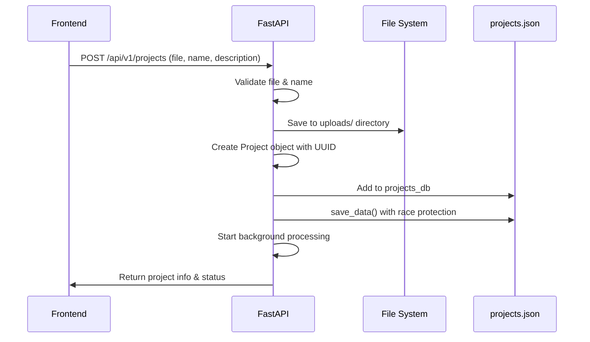
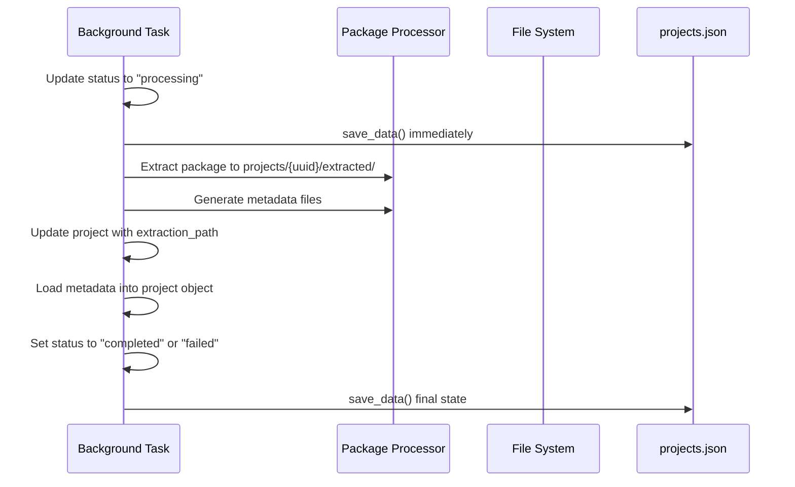
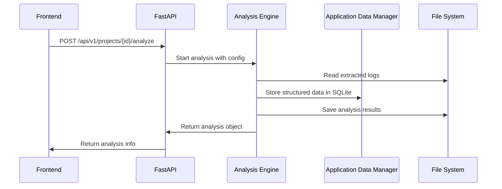

# Project Management System Design

## 🎯 **Overview**

This document defines the robust project management architecture for the prplOS LCM Log Analysis System, designed to prevent data loss, ensure consistency, and provide reliable project lifecycle management.

## 🏗️ **Architecture Principles**

### **1. Single Source of Truth**
- **`projects.json`**: Authoritative project registry (source of truth on disk)
- **Disk-first reads**: API endpoints read from disk, not just in-memory cache
- **UUID-based identification**: Immutable project identifiers
- **Atomic operations**: All-or-nothing data changes with file system synchronization
- **Defensive programming**: Protection against race conditions
- **Cross-machine compatibility**: Path normalization for different DATA_DIR configurations

### **2. Project-Centric Data Organization**
```
/data/WNC/LCM-Logs-Data/projects/{project-uuid}/
├── extracted/                      ← Package extraction results
│   ├── metadata/                   ← Extraction metadata
│   │   ├── package_structure.json
│   │   └── application_discovery.json
│   └── {original-package-contents}
├── analysis/                       ← Project-specific analyses
│   ├── {analysis-uuid}/
│   └── {analysis-uuid}/
└── logs/                          ← Project-specific logs
```

### **3. Data Integrity Mechanisms**
- **Race condition protection** in `save_data()`
- **Atomic file operations** with `.tmp` and `.backup` files
- **File system synchronization** using `fsync()` for cross-machine consistency
- **File locking** (when supported) to prevent read-during-write issues
- **Retry logic** with exponential backoff for transient read failures
- **Consistency validation** between memory and disk
- **Automatic backup creation** before modifications
- **Path normalization** for cross-machine DATA_DIR compatibility

## 🔄 **Project Lifecycle**

### **Phase 1: Project Creation**


### **Phase 2: Background Processing**


### **Phase 3: Analysis Lifecycle**


## 🛡️ **Data Protection Strategies**

### **1. Race Condition Protection**

**Problem**: FastAPI auto-reload can cause `projects_db` to be empty during module reloading, leading to `projects.json` corruption.

**Solution**: Defensive `save_data()` function:

```python
def save_data(allow_empty=False):
    """Save with comprehensive protection"""
    # ... prepare projects_data ...
    
    # DEFENSIVE CHECK: Prevent empty save unless intentional
    if len(projects_data) == 0 and not allow_empty and os.path.exists(PROJECTS_FILE):
        try:
            with open(PROJECTS_FILE, 'r') as f:
                existing_data = json.load(f)
            if len(existing_data) > 0:
                logger.warning("🛡️ DEFENSIVE SAVE PROTECTION ACTIVATED")
                logger.warning(f"Existing: {len(existing_data)} projects, Memory: {len(projects_db)}")
                return  # PREVENT CORRUPTION
        except (json.JSONDecodeError, FileNotFoundError):
            logger.info("Corrupted/missing file, allowing empty save")
    
    # ... atomic write operation ...
```

**Protection Features**:
- ✅ Default protection for all normal operations
- ✅ `allow_empty=True` bypass for intentional clearing
- ✅ Detailed logging when protection activates
- ✅ Graceful handling of corrupted files

### **2. Atomic File Operations with File System Synchronization**

All critical file writes use atomic operations with explicit synchronization for cross-machine consistency:

```python
def save_data(allow_empty=False):
    """Atomic write with backup and file system synchronization"""
    temp_file = PROJECTS_FILE + '.tmp'
    backup_file = PROJECTS_FILE + '.backup'
    
    try:
        # Create backup of existing file
        if os.path.exists(PROJECTS_FILE):
            shutil.copy2(PROJECTS_FILE, backup_file)
        
        # Write to temporary file with explicit flushing and synchronization
        # This ensures data is fully written to disk before rename (critical for NFS/network mounts)
        with open(temp_file, 'w') as f:
            json.dump(projects_data, f, indent=2)
            f.flush()  # Flush Python's buffer to OS
            try:
                os.fsync(f.fileno())  # Force OS to write to disk (critical for cross-machine consistency)
            except OSError as e:
                # fsync may fail on some filesystems (e.g., network mounts), log but continue
                logger.debug(f"fsync failed (this is OK on some filesystems): {e}")
        
        # Verify file was written correctly before renaming
        if not os.path.exists(temp_file):
            raise Exception(f"Temporary file {temp_file} was not created")
        
        temp_stat = os.stat(temp_file)
        if temp_stat.st_size == 0:
            raise Exception(f"Temporary file {temp_file} is empty after write")
        
        # Atomic rename (on most filesystems, this is atomic, but ensure parent directory is synced)
        try:
            parent_dir = os.path.dirname(PROJECTS_FILE)
            if parent_dir:
                parent_fd = os.open(parent_dir, os.O_RDONLY)
                try:
                    os.fsync(parent_fd)  # Sync directory metadata (ensures rename is visible)
                finally:
                    os.close(parent_fd)
        except Exception as e:
            logger.debug(f"Could not sync parent directory: {e}")
        
        os.rename(temp_file, PROJECTS_FILE)
        
        # Final sync to ensure rename is visible to all readers
        try:
            final_fd = os.open(PROJECTS_FILE, os.O_RDONLY)
            try:
                os.fsync(final_fd)
            finally:
                os.close(final_fd)
        except Exception as e:
            logger.debug(f"Could not sync final file: {e}")
            
    except Exception as e:
        # Cleanup on failure
        if os.path.exists(temp_file):
            os.remove(temp_file)
        raise
```

**Key Features**:
- ✅ **Explicit flushing**: `f.flush()` ensures Python buffers are written to OS
- ✅ **File system sync**: `os.fsync()` forces OS to write to disk
- ✅ **Directory metadata sync**: Ensures rename is visible immediately
- ✅ **Graceful degradation**: Handles filesystems that don't support fsync
- ✅ **File validation**: Verifies file exists and is not empty before rename

### **3. Data Consistency Validation**

Regular validation ensures memory and disk are synchronized:

```python
def validate_data_consistency():
    """Validate projects_db matches projects.json"""
    try:
        # Load from disk
        with open(PROJECTS_FILE, 'r') as f:
            file_projects = json.load(f)
        
        # Compare counts
        memory_count = len(projects_db)
        file_count = len(file_projects)
        
        if memory_count != file_count:
            logger.warning(f"INCONSISTENCY: memory={memory_count}, file={file_count}")
            return False
        
        # Validate each project exists in both
        for project_id in projects_db:
            if project_id not in file_projects:
                logger.warning(f"Project {project_id} missing from file")
                return False
        
        return True
    except Exception as e:
        logger.error(f"Validation failed: {e}")
        return False
```

## 📁 **File System Architecture**

### **Directory Structure**
```
DATA_DIR/                           ← Configurable root
├── projects.json                   ← Master project registry
├── projects.json.backup            ← Automatic backup
├── prplos_analysis.db              ← SQLite database
├── logs/                           ← Application logs
│   ├── app.log
│   └── backend.log
├── uploads/                        ← Original packages
│   ├── package1.tar.gz
│   └── package2.tar.gz
├── projects/                       ← Project-specific data
│   ├── {project-uuid-1}/
│   │   ├── extracted/
│   │   │   ├── metadata/
│   │   │   │   ├── package_structure.json
│   │   │   │   ├── application_discovery.json
│   │   │   │   └── extraction_log.txt
│   │   │   ├── wnc-steer/
│   │   │   ├── wnc-acs/
│   │   │   └── otbr-agent/
│   │   ├── analysis/
│   │   │   ├── {analysis-uuid-1}/
│   │   │   │   ├── analysis_config.json
│   │   │   │   ├── analysis_results.json
│   │   │   │   └── visualizations/
│   │   │   └── {analysis-uuid-2}/
│   │   └── logs/
│   │       ├── processing.log
│   │       └── analysis.log
│   └── {project-uuid-2}/
├── analysis/                       ← Global analysis artifacts
├── temp/                          ← Temporary processing
├── backups/                       ← Scheduled backups
└── uploads/                       ← Uploaded packages
```

### **Path Management with Cross-Machine Normalization**

All paths use absolute references from DATA_DIR, with automatic normalization for cross-machine compatibility:

```python
def load_data():
    """Load data from files with path normalization for cross-machine compatibility"""
    # Normalize paths based on current DATA_DIR (fixes cross-machine issues)
    for project_id, project_dict in projects_data.items():
        stored_project_root = project_dict.get("project_root_path", "")
        expected_project_root = os.path.join(settings.DATA_DIR, "projects", project_id)
        
        # Update paths if they don't match current DATA_DIR
        if stored_project_root and stored_project_root != expected_project_root:
            if not os.path.exists(stored_project_root):
                # Stored path doesn't exist, use expected path based on current DATA_DIR
                project_dict["project_root_path"] = expected_project_root
                # Update related paths (extraction_path, extraction_metadata_path)
                # ... rebuild relative paths ...
```

**Project Model Path Normalization**:

```python
class Project:
    def get_project_root_path(self) -> str:
        """Get absolute project root path, normalized to current DATA_DIR if needed"""
        settings = get_settings()
        expected_path = os.path.join(settings.DATA_DIR, "projects", str(self.id))
        
        # If no path set or path doesn't match current DATA_DIR, use expected path
        if not self.project_root_path:
            self.project_root_path = expected_path
        elif not self.project_root_path.startswith(settings.DATA_DIR):
            # Path is from different machine's DATA_DIR, normalize it
            if not os.path.exists(self.project_root_path):
                # Old path doesn't exist, use new one
                self.project_root_path = expected_path
            # else: keep old path if it exists (might be on shared storage)
        
        return self.project_root_path
```

**Key Features**:
- ✅ **Automatic normalization**: Paths are normalized on load if they don't match current DATA_DIR
- ✅ **Cross-machine compatibility**: Projects created on one machine work on another
- ✅ **Shared storage support**: Preserves paths that exist (e.g., NFS mounts)
- ✅ **Relative path reconstruction**: Rebuilds extraction paths relative to new project root

## 🌐 **Cross-Machine Synchronization**

### **Disk as Source of Truth**

The system ensures consistency across different client machines by treating `projects.json` as the authoritative source:

**API Endpoint Behavior**:
- **GET `/api/v1/projects`**: Always reads from disk (`projects.json`) on each request
- **GET `/api/v1/projects/{project_id}`**: Reads from disk if project not in memory or if `refresh=true`
- **Memory cache**: Kept in sync for performance, but disk is authoritative

**Implementation**:

```python
@app.get("/api/v1/projects")
async def list_projects(refresh: bool = Query(False)):
    """List all projects - reads from disk to ensure consistency across browsers/machines"""
    # Always read from disk to ensure consistency
    if os.path.exists(PROJECTS_FILE):
        # Use file locking to ensure we read a consistent state
        with open(PROJECTS_FILE, 'r') as f:
            if HAS_FCNTL:
                fcntl.flock(f.fileno(), fcntl.LOCK_SH)  # Shared lock for reading
            try:
                projects_data = json.load(f)
            finally:
                if HAS_FCNTL:
                    fcntl.flock(f.fileno(), fcntl.LOCK_UN)  # Release lock
    
    # Set cache control headers to prevent browser caching
    response = JSONResponse(content={"projects": projects})
    response.headers["Cache-Control"] = "no-cache, no-store, must-revalidate"
    response.headers["Pragma"] = "no-cache"
    response.headers["Expires"] = "0"
    return response
```

**File Locking and Retry Logic**:

```python
# Retry logic with exponential backoff for transient read failures
max_retries = 3
retry_delay = 0.1

for attempt in range(max_retries):
    try:
        with open(PROJECTS_FILE, 'r') as f:
            if HAS_FCNTL:
                fcntl.flock(f.fileno(), fcntl.LOCK_SH)  # Shared lock
            try:
                projects_data = json.load(f)
            finally:
                if HAS_FCNTL:
                    fcntl.flock(f.fileno(), fcntl.LOCK_UN)
            break  # Successfully read
    except json.JSONDecodeError as e:
        if attempt < max_retries - 1:
            # File might be mid-write, wait and retry
            time.sleep(retry_delay)
            retry_delay *= 2  # Exponential backoff
        else:
            raise
```

**Benefits**:
- ✅ **Immediate consistency**: All machines see updates immediately after write
- ✅ **No stale cache**: Browser and backend cache are bypassed
- ✅ **Race condition protection**: File locking prevents read-during-write
- ✅ **Graceful error handling**: Retry logic handles transient issues

## 🔍 **Error Handling & Recovery**

### **Common Issues & Solutions**

#### **Issue: Empty `projects.json`**
**Symptoms**: File contains `{}`, all projects missing
**Recovery**:
```bash
# 1. Stop backend
./scripts/backend-stop.sh

# 2. Restore from backup
cp /data/WNC/LCM-Logs-Data/projects.json.backup /data/WNC/LCM-Logs-Data/projects.json

# 3. Verify recovery
python3 -c "import json; print(f'Recovered {len(json.load(open(\"/data/WNC/LCM-Logs-Data/projects.json\")))} projects')"

# 4. Restart backend
./scripts/backend-start.sh
```

#### **Issue: Orphaned Project Directories**
**Symptoms**: Project folders exist but not in `projects.json`
**Recovery**:
```bash
# Run recovery script
python3 scripts/recover_projects.py

# Or use API
curl -X POST http://localhost:8000/api/v1/admin/recover-projects
```

#### **Issue: Corrupted Project Data**
**Symptoms**: Cannot load project, JSON parse errors
**Recovery**:
```bash
# 1. Identify corrupted project
tail -f logs/app.log | grep "Failed to convert project"

# 2. Remove corrupted entry manually
python3 -c "
import json
with open('projects.json', 'r') as f:
    data = json.load(f)
del data['CORRUPTED_PROJECT_ID']
with open('projects.json', 'w') as f:
    json.dump(data, f, indent=2)
"

# 3. Restart backend
./scripts/backend-restart.sh
```

### **Monitoring & Alerts**

#### **Data Consistency Monitoring**
```python
# Run every 5 minutes
def monitor_data_consistency():
    if not validate_data_consistency():
        logger.error("🚨 DATA CONSISTENCY FAILURE DETECTED")
        # Send alert
        # Create backup
        # Log detailed state
```

#### **Disk Space Monitoring**
```python
def monitor_disk_space():
    """Monitor DATA_DIR disk usage"""
    usage = shutil.disk_usage(settings.DATA_DIR)
    free_percent = (usage.free / usage.total) * 100
    
    if free_percent < 10:
        logger.error(f"🚨 LOW DISK SPACE: {free_percent:.1f}% free")
```

## 🛠️ **Maintenance Operations**

### **Regular Maintenance Tasks**

#### **Daily**
- [ ] Validate data consistency
- [ ] Check disk space usage
- [ ] Review application logs
- [ ] Verify backup creation

#### **Weekly**
- [ ] Clean up temporary files
- [ ] Archive old logs
- [ ] Test recovery procedures
- [ ] Update system documentation

#### **Monthly**
- [ ] Full system backup
- [ ] Performance optimization
- [ ] Security audit
- [ ] Dependency updates

### **Cleanup Operations**

#### **Safe Project Deletion**
```python
def delete_project_safely(project_id: str):
    """Safe project deletion with validation"""
    try:
        # 1. Validate project exists
        if project_id not in projects_db:
            raise HTTPException(404, "Project not found")
        
        project = projects_db[project_id]
        
        # 2. Create backup before deletion
        backup_project_data(project)
        
        # 3. Remove file system data
        cleanup_project_files(project)
        
        # 4. Remove from memory
        del projects_db[project_id]
        
        # 5. Save updated registry
        save_data()
        
        logger.info(f"Project {project_id} deleted successfully")
        
    except Exception as e:
        logger.error(f"Failed to delete project {project_id}: {e}")
        raise
```

#### **System-wide Cleanup**
```python
def cleanup_system():
    """Clean up temporary and orphaned files"""
    try:
        # Clean temp directory
        temp_dir = os.path.join(settings.DATA_DIR, "temp")
        if os.path.exists(temp_dir):
            shutil.rmtree(temp_dir)
            os.makedirs(temp_dir, exist_ok=True)
        
        # Remove old log files
        clean_old_logs()
        
        # Remove orphaned uploads
        clean_orphaned_uploads()
        
        # Validate and repair data
        repair_data_inconsistencies()
        
    except Exception as e:
        logger.error(f"System cleanup failed: {e}")
```

## 📊 **Performance & Scalability**

### **Performance Considerations**

- **In-memory caching**: `projects_db` for fast access (kept in sync with disk)
- **Disk-first reads**: API endpoints read from disk for consistency, memory cache updated asynchronously
- **Lazy loading**: Load analysis data only when needed
- **Async operations**: Background processing for heavy tasks
- **Database optimization**: Indexed queries in SQLite/PostgreSQL
- **File system sync overhead**: Minimal impact (~1-2ms per write) for cross-machine consistency
- **File locking**: Optional, gracefully degrades on unsupported filesystems

### **Scalability Patterns**

- **Horizontal scaling**: Multiple worker processes
- **Database sharding**: Separate DBs per environment
- **File system partitioning**: Multiple DATA_DIR locations
- **Caching layers**: Redis for frequently accessed data

## 🔒 **Security Considerations**

### **File System Security**
- Proper file permissions (755 for directories, 644 for files)
- User isolation (dedicated service account)
- Directory traversal prevention
- Input validation for all file operations

### **Data Protection**
- Regular automated backups
- Encryption at rest (for sensitive deployments)
- Access logging and monitoring
- Secure file upload validation

## 📋 **Implementation Checklist**

### **Core Components**
- [x] Race condition protection in `save_data()`
- [x] Atomic file operations with file system synchronization (`fsync()`)
- [x] Cross-machine path normalization
- [x] Disk as source of truth for API endpoints
- [x] File locking and retry logic for read operations
- [x] HTTP cache control headers
- [x] Data consistency validation
- [x] Project-centric directory structure
- [x] Comprehensive error handling
- [x] Automatic backup creation

### **Monitoring & Maintenance**
- [ ] Data consistency monitoring service
- [ ] Disk space alerts
- [ ] Performance monitoring
- [ ] Automated cleanup jobs
- [ ] Recovery script automation

### **Documentation & Testing**
- [x] Comprehensive design documentation
- [x] Configuration management guide
- [ ] Recovery procedure testing
- [ ] Performance benchmarking
- [ ] Security audit procedures

## 📚 **Related Documentation**

For detailed information on configuration management:

- **[DATA_DIR_CONFIGURATION.md](DATA_DIR_CONFIGURATION.md)**: Configuration management for DATA_DIR

## 🎯 **Summary**

This project management design provides a robust foundation for handling the complex lifecycle of log analysis projects while maintaining data integrity and system reliability. Key improvements include:

1. **Cross-machine consistency**: Disk-first reads ensure all clients see the same data
2. **File system synchronization**: Explicit `fsync()` calls ensure writes are immediately visible
3. **Path normalization**: Automatic handling of different DATA_DIR configurations
4. **Race condition protection**: File locking and retry logic prevent data corruption
5. **Browser cache prevention**: HTTP headers ensure fresh data on every request

The system is designed to work reliably across different machines, network filesystems, and deployment scenarios while maintaining high performance through intelligent caching strategies.
